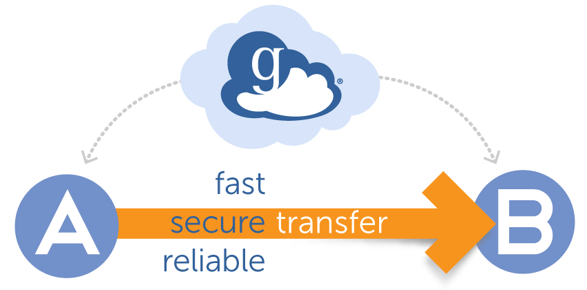

Connect and Transfer to Rockfish
################################

In order to use the Rockfish cluster robustly by command lines.

* **gateway**: login.rockfish.jhu.edu
* OpenSSH SSH client (remote login program)
  * ssh -XY login.rockfish.jhu.edu -l <userid>
  * ssh -XY <userid>@login.rockfish.jhu.edu
* Login nodes [01 - 03]

**For Windows machines**
  You can use `PuTTY`_ or MobaXterm (Home Edition → Installer edition). MobaXterm provides both a SFTP application for file transfer and a SSH client for command lines with X-Windows (X11 server) system (for graphical user interface (GUI) running on Rockfish login nodes).

**For Mac OS machines**
  You can use Terminal program (installed within MacOS) for your SSH client. (In the taskbar, search for “terminal”.) However, for running graphical user interface (GUI) programs on Rockfish login nodes, the X11-server program XQuartz needs to be installed. See XQuartz for download instructions.

  .. warning:: Make sure you have a SSH client and X11 server installed in your computer (Linux/MacOS).

.. _PuTTY: https://www.putty.org

Access to login Node
********************

Once you establish a connection, SSH will prompt for your password. Once sign into the login node, you should see the welcome messages

.. code-block:: console

  Thu Mar 10 09:45:29 2022 from 172.28.3.75
   ____            _    _____ _     _
  |  _ \ ___   ___| | _|  ___(_)___| |__
  | |_) / _ \ / __| |/ / |_  | / __| |_ \
  |  _ < (_) | (__|   <|  _| | \__ \ | | |
  |_| \_\___/ \___|_|\_\_|   |_|___/_| |_|
  [STATUS] loading software modules
  [STATUS] modules are Lmod (https://lmod.readthedocs.io/en/latest/)
  [STATUS] software is Spack (https://spack.readthedocs.io/en/latest/)
  [STATUS] the default modules ("module restore") use GCC 9 and OpenMPI 3.1
  [STATUS] you can search available modules with: module spider <name>
  [STATUS] you can list available modules with: module avail
  [STATUS] loading a compiler, MPI, Python, or R will reveal new packages
  [STATUS] and you can check your loaded modules with: module list --terse
  [STATUS] to hide this message in the future: touch ~/.no_rf_banner
  [STATUS] restoring your default module collection now

  Quota and usage information. Updated hourly. Use 'gpfsquota'
  Usage for group MyGroup
  FS         Usage   Quota  Files_Count  File_Quota
  ---        ---     ---    ---          ---
  data       5.07T   10T    2287948      4194304
  scratch16  1.939T  10T    1005210      10240000
  scratch4   4.177T  10T    1159700      20480000
  [userid@login02 ~]$

Transfer files
********************

Copy file from Bluecrab cluster or any computer.

Copy files via scp command
******************************

Users can use ``scp`` command to copy a file or a directory from any computer to the Rockfish cluster via command line.

.. code-block:: console
  :linenos:
  $ scp -r DIR <userid>@rfdtn1.rockfish.jhu.edu:/scratch16/<PI-id>/<user-id>/

Synchronize Files via rsync command
***********************************

Using ``rsync`` command, you can copy and synchronize your files and directories between two different locations.
The syntax for rsync command is similar to scp command.

.. code-block:: console
  :linenos:
  $ rsync -rav  ~/data <user-id>@rfdtn1.rockfish.jhu.edu:~/data/
  $ rsync -rav --delete --exclude-from=~/exclude.txt ~/data <user-id>@rfdtn1.rockfish.jhu.edu:~/data/

.. note::
  --delete                delete extraneous files from dest dirs
  --exclude-from=FILE     read exclude patterns from FILE

Globus
******

Globus makes it much easier to work with data.
How to transfer a large amounts of data using Globus see `Rockfish Globus instructions`_.

.. _Rockfish Globus instructions: https://www.arch.jhu.edu/data-transfer-with-globus/
