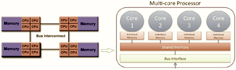

================
HPC Terminology
================

This is a high-level overview of features of Rockfish Cluster at ARCH.

---------------------------
Node
---------------------------

A standalone "computer in a box". Usually comprised of multiple CPUs/processors/cores, memory, network interfaces, etc.

---------------------------
Cluster
---------------------------

A group of nodes networked together so a program can run on them in parallel.

---------------------------
CPU/Processor(Socket)/Core
---------------------------

In the past, a CPU (Central Processing Unit) was a singular execution component for a computer. Then, multiple-core CPU is incorporated into a node. It is subdivided into multiple "cores" inside processors (or sockets). Each core is a unique execution unit like a CPU in the past. RAM memory between different sockets is connected with a bus interface.

:width: 400
  :alt: Multicore CPU (NUMA system)
