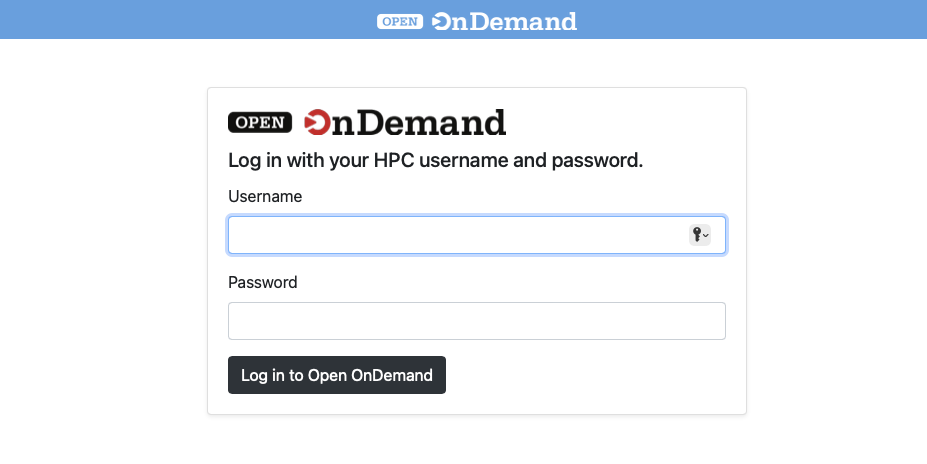

Open OnDemand
##############

Open OnDemand (OOD) is a way for users to access to their HPC resources via a web interface for the Rockfish cluster. It is a web-portal that provides a shell, file browser, and graphical interface for applications such as IGV, Matlab, ParaView, Jupyter and RStudio Server, etc.

A Rockfish account is necessary to use OOD. Also, a campus network connection or VPN is not required to access the OOD portal.

|ood1|

Once authenticated you will be at the main page.

|ood2|

|ood3|

Along the top are a pull-down menus for a File Browser, a Job Composer, a shell, and a list of Interactive Apps.

  :align="center"

.. |ood2| image:: images/ood2.png
  :alt: Authenticated
  :width: 70 %
  :align="center"

.. |ood3| image:: images/ood3.png
  :alt: Message
  :width: 70 %
  :align="center"
