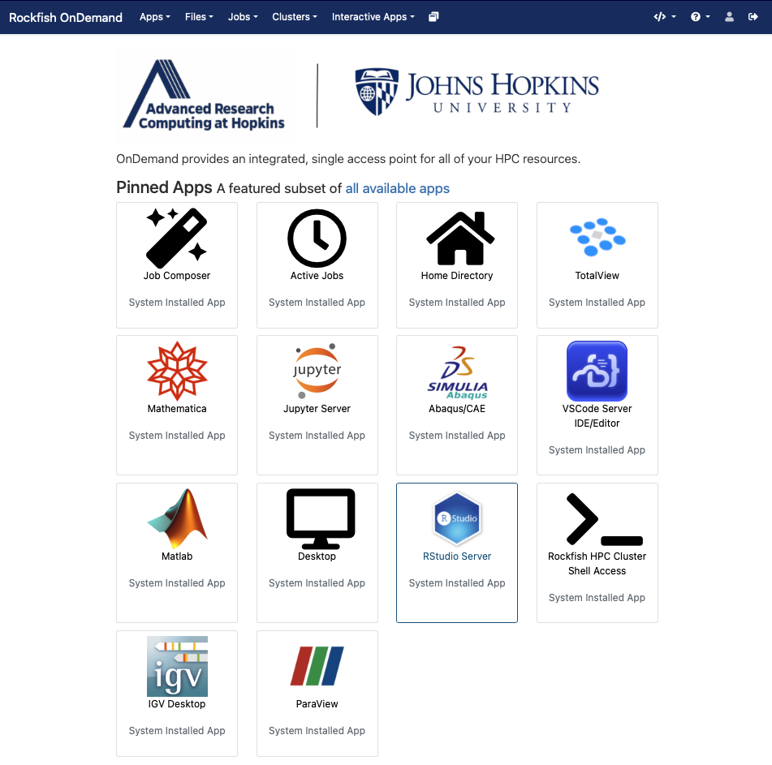
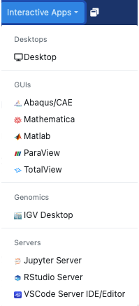

Open OnDemand
##############

Open OnDemand (OOD) is an NSF-funded open-source HPC portal. It is a way for all our users to access the Rockfish cluster HPC resources via a web interface. It is a web-portal that provides a shell, file browser, and graphical interface for applications such as IGV, Matlab, ParaView, Jupyter and RStudio Server, etc.

A Rockfish account is necessary to use OOD. Also, a campus network connection or VPN is required to access the OOD portal.

|ood1|

Once authenticated, you will be on the main page.

|ood2|

|ood3|

Along the top are a pull-down menus for an Apps, Files App, Jobs, shell, and a list of Interactive Apps.

The file browser application provides a web-based file explorer that allows the user to remotely interact with the files on the Rockfish cluster’s local file system.
You can drag and drop files, download entire directories, and also move files between directories
all from within the web browser.

|ood4|

Interactive Apps
****************

Open OnDemand offers a few interactive applications for a user to use: Abaqus/CAE, RStudio, Jupyter Lab and Notebook, MATLAB, Linux remote desktops on Rockfish cluster.
|ood5|

Remote Desktop
****************

Once in awhile, it is helpful to use a graphical interface to access data or certain programs. In this case, users have typically utilized VNC or X11 forwarding. Both of these tools have complications, either in complexity of setup or in performance. The Remote Desktop option from OOD simplifies the configuration of a VNC desktop session on a compute node.

First request the desktop application, i.e. anything under Desktops or GUIs, which you would like to use. Here we choose the Desktop.

|ood6|

You will next see a form to specify the resources you’d like for the job.

|ood6|

You will next see a form to specify the resources you’d like for the job. Specifically the duration of the job (wall time), the number of cpus (cores), node type, etc. Below we ask for five hours and 2 cores. We also optionally specify a standard compute defq  with 4 Gb memory each cpu. If you wish you can also receive an email notification for when the job starts. Once you have filled out the form click Launch.

.. |ood1| image:: images/ood1.png
  :alt: Login
  :width: 70 %

.. |ood3| image:: images/ood3.png
  :alt: Message
  :width: 80 %

.. |ood4| image:: images/ood4.png
  :alt: File
  :width: 80 %

.. |ood7| image:: images/ood7.png
  :alt: Remote
  :width: 80 %
